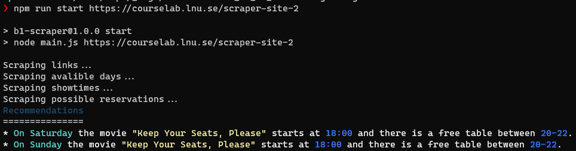

# B1 Scraper
A  commandlinebased webscraper application that scrapes 2 websites to find working calender days and which movies and restaurant is recommended

## Installation instructions
Ensure that a working node.js installation is working
https://nodejs.org/en/download/

    npm install

## Running instructions
To run the application run theese commands

    npm run start https://courselab.lnu.se/scraper-site-1

    npm run start https://courselab.lnu.se/scraper-site-2

To run the linters:

    npm run lint